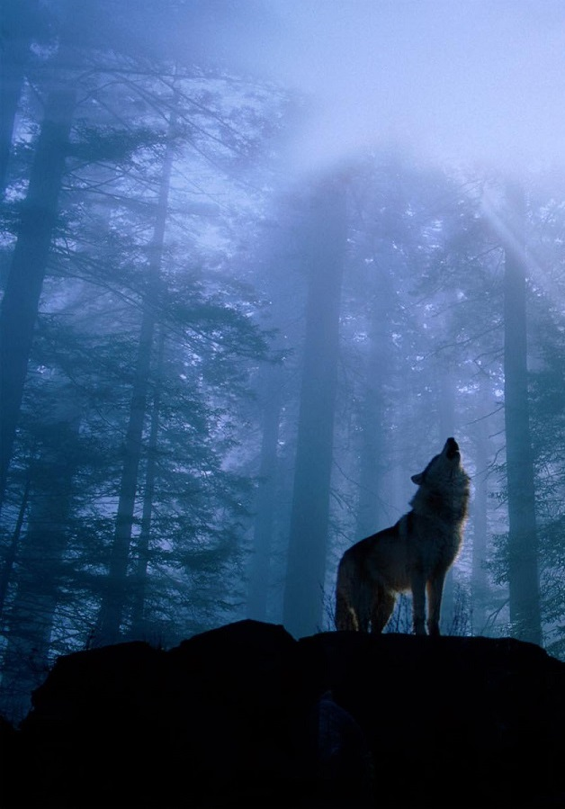
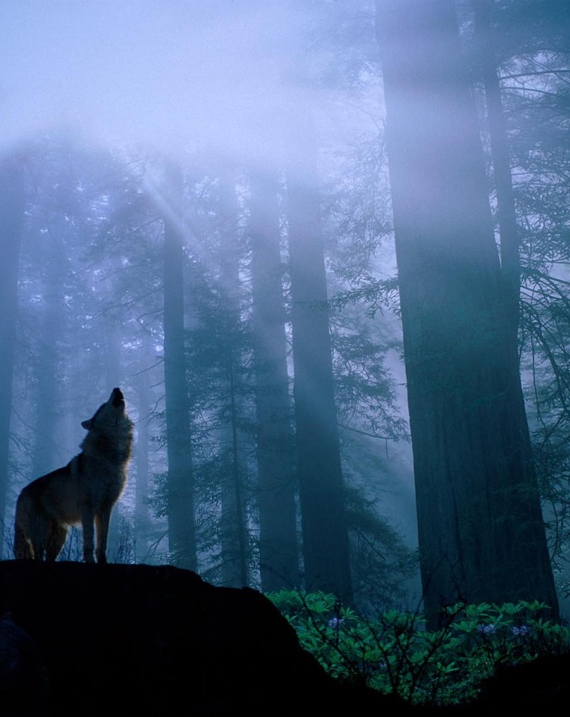
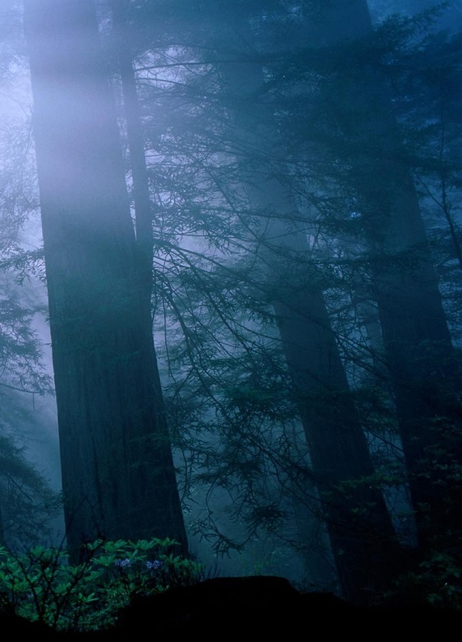
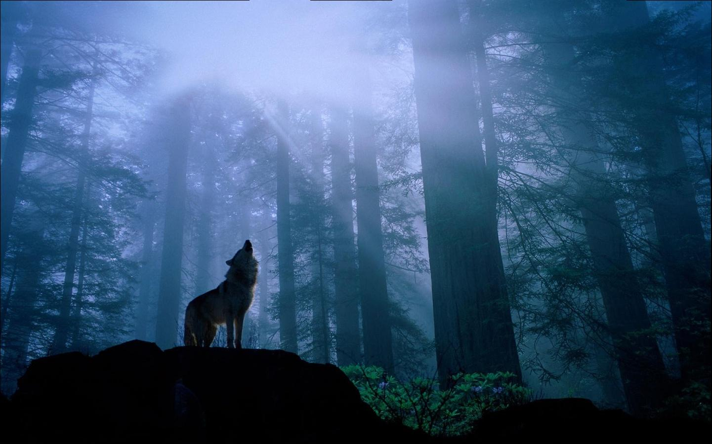

# 陳冠言 (102061243)

# Project 3: Panorama Stitching

## Overview
Panoramic stitching is an early success of computer vision. Matthew Brown and David G. Lowe published a famous [panoramic image stitching paper](http://www.cs.ubc.ca/~lowe/papers/07brown.pdf) in 2007. Since then, automatic panorama stitching technology has been widely adopted in many applications such as Google Street View, panorama photos on smartphones, and stitching software such as [Photosynth](http://photosynth.net/) and [AutoStitch](http://cs.bath.ac.uk/brown/autostitch/autostitch.html).

In this programming assignment, we will match SIFT keypoints from multiple images to build a single panoramic image. This will involve several tasks:

* Detect SIFT points and extract SIFT descriptor for each keypoint in an image using vlfeat, or
  detect Corner points and extract SIFT descriptor (vlfeat).

* Compare two sets of SIFT descriptors coming from two different images and find matching keypoints (`SIFTSimpleMatcher.m`).

* Given a list of matching keypoints, use least-square method to find the affine transformation matrix that maps positions in image 1 to positions in image 2 (`ComputeAffineMatrix.m`).

* Use RANSAC to give a more robust estimate of affine transformation matrix (`RANSACFit.m`).

* Given that transformation matrix, use it to transform (shift, scale, or skew) image 1 and overlay it on top of image 2, forming a panorama. 

* Stitch multiple images together under a simplified case of real-world scenario ('MultipleStitch.m').

## Implementation
1. Matching SIFT Descriptors (SIFTSimpleMatcher.m)

	First get the size of descriptors
	
		num1=size(descriptor1,1);
		num2=size(descriptor2,1);
	
	Then use a for loop to run through 1 to num1.In the loop, first use `repmat` to get `d1_tmp`, which has same number of rows as descriptor2, with data in every rows are same as row"i" in descriptor1, then calculate the distance by `distance=sqrt(sum((d1_tmp-descriptor2).^2,2))`. And then sort the `distance` , if the smallest value in `distance` is smaller than threshold(here is 0.7)*the next smallest value, save its information into `match` array.

		for i=1:num1
			d1_tmp=repmat(descriptor1(i,:), num2, 1);
			distance=sqrt(sum((d1_tmp-descriptor2).^2,2));
			distance_tmp=sort(distance);
			if distance_tmp(1)<thresh*distance_tmp(2)
			match=[match; i, find(distance==distance_tmp(1))];
			end
		end

2. Fitting the Transformation Matrix (ComputeAffineMatrix.m)

	Here we want to get the transformation matrix `H` (H*P1=P2) that maps an image 1 point to the corresponding coordinates in image 2. First,convert the input points to homogeneous coordintes.

		P1 = [Pt1';ones(1,N)];
		P2 = [Pt2';ones(1,N)];

	Then by using `\`, we can get the transformation matrix `H`.

		H = (P1'\P2')';

3. RANSAC (RANSACFit.m)  

	Instead of directly feeding all of SIFT keypoint matches into `ComputeAffineMatrix.m`, we will use RANSAC (“RANdom SAmple Consensus”) to select only “inliers” to use to compute the transformation matrix.

	Here we only need to finish the `ComputeError` function, first initialize the `dists` array.

		dists = zeros(size(match,1),1);

	Then get the size of `match` array, and convert the points which match to `pt2` in `pt1` by using the transformation matrix `H`, and we can calculate the Euclidean distance.

		N = size(match,1);
		pt1_conv=(H*([pt1(match(:, 1),:)';ones(1,N)]))';
		dists=sqrt(sum((pt1_conv-[pt2(match(:, 2),:)';ones(1,N)]').^2,2));
	
4. Stitching Multiple Images (MultipleStitch.m)  

	Finally, we want to stich multiple images together, and we only need to finish the `makeTransformToReferenceFrame` function in `MultipleStitch.m`.

	Here,first we make a 3*3 Identity matrix.

		T=eye(3);

	Then, when (refFrameIndex> currentFrameIndex), get new transformation matrix by times the two matrix `i_To_iPlusOne_Transform{currentFrameIndex}` and `T` together , and add 1 to currentFrameIndex until refFrameIndex=currentFrameIndex.

		while refFrameIndex> currentFrameIndex
    			T=i_To_iPlusOne_Transform{currentFrameIndex}*T;
    			currentFrameIndex=currentFrameIndex+1;
		end
	
	And when (currentFrameIndex> refFrameIndex), get new transformation matrix by times the two matrix `pinv(i_To_iPlusOne_Transform{currentFrameIndex})` (Moore-Penrose pseudoinverse of `i_To_iPlusOne_Transform{currentFrameIndex}`)and `T` together , and minus 1 to currentFrameIndex until refFrameIndex=currentFrameIndex.

		while currentFrameIndex> refFrameIndex
			T=pinv(i_To_iPlusOne_Transform{currentFrameIndex-1})*T;
			currentFrameIndex=currentFrameIndex-1;
		end

## Installation
1. Download and unpack [VLFeat binary package](http://www.vlfeat.org/download.html)

2. Enter `run('VLFEATROOT/toolbox/vl_setup')` in MATLAB command line

3. Download the code and open `StitchTester.m` , set the input image `('../data/yosemite*.jpg') ` and output path `'../results/yosemite.jpg'`then run the code .

## Results

<table border=1>
<tr>
<td>

</td>
</tr>
</table>

<table border=2>
<tr>
<td>

</td>
</tr>
</table>

<table border=3>
<tr>
<td>

</td>
</tr>
</table>

<table border=4>
<tr>
<td>

</td>
</tr>
</table>

<table border=5>
<tr>
<td>

</td>
</tr>
</table>

<table border=6>
<tr>
<td>

</td>
</tr>
</table>

<table border=7>
<tr>
<td>

</td>
</tr>
</table>
